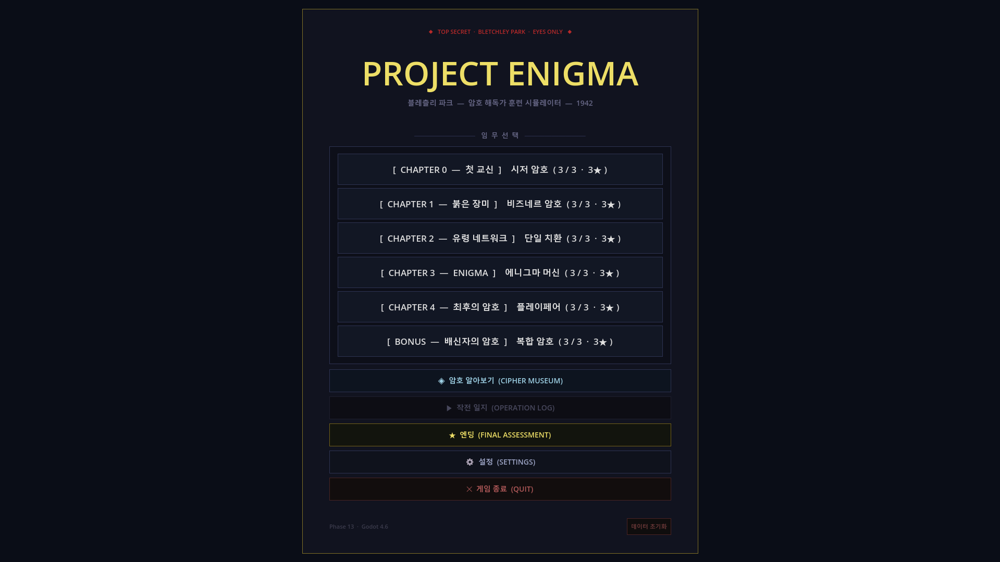
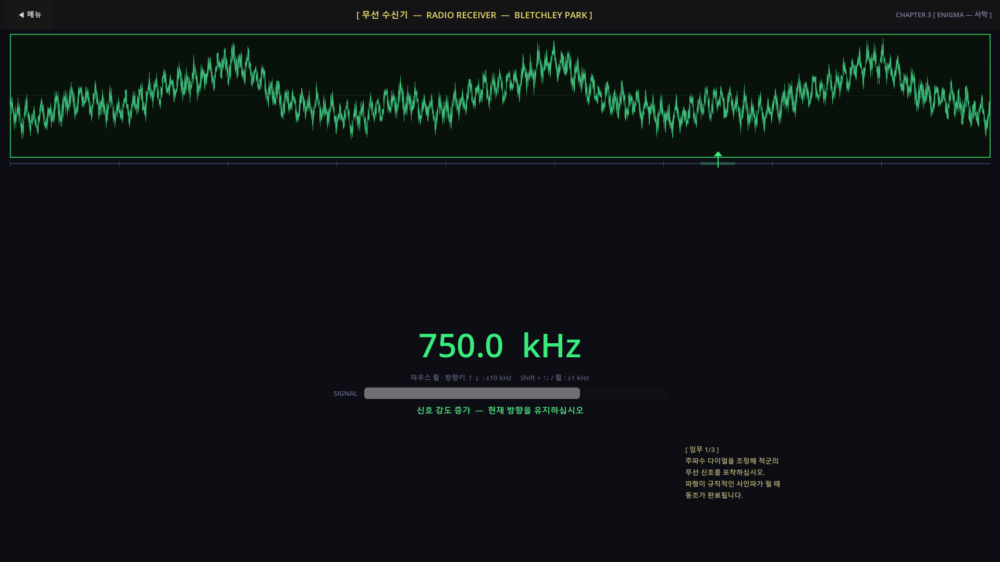
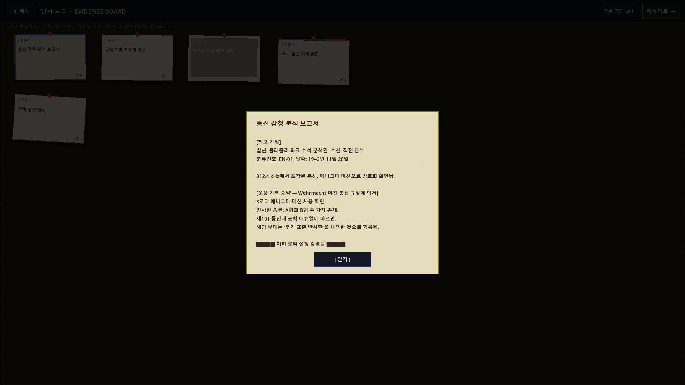
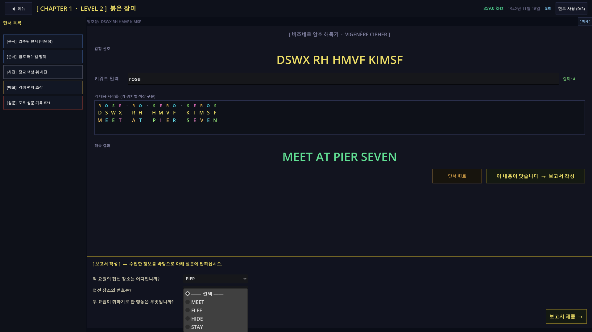
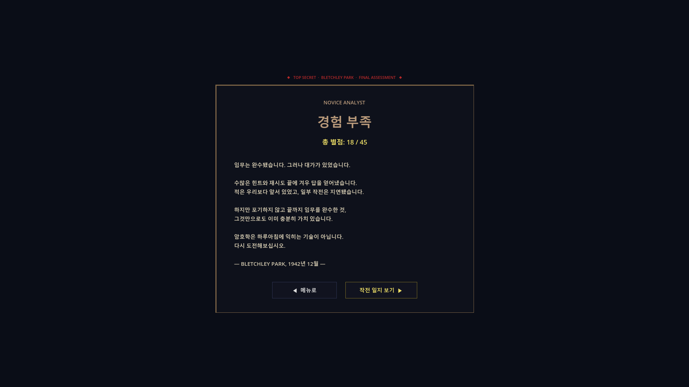
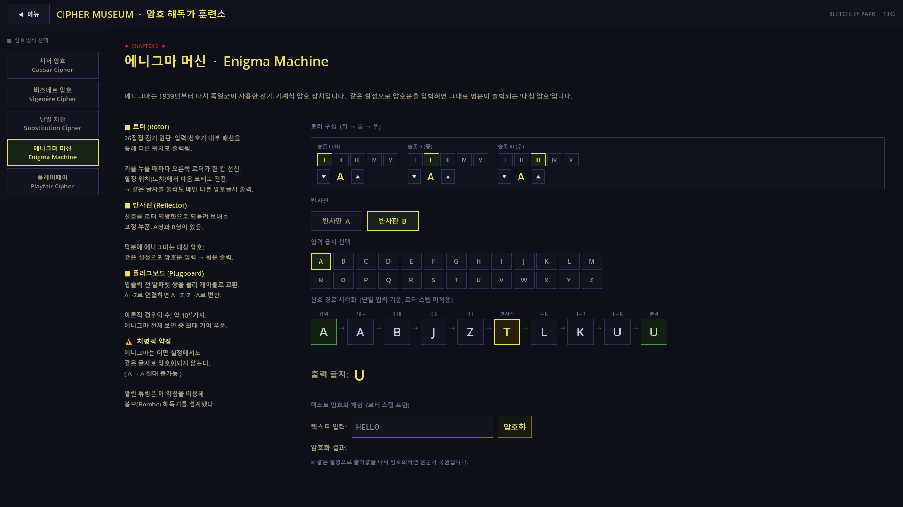

# ENIGMA — 암호 해독 퍼즐 게임

**1942년 블레츨리 파크.** 당신은 영국 방첩부 소속 암호 분석관입니다.
파편화된 적군 통신을 수집하고, 단서를 조합하고, 암호를 해독하십시오.

---

## 스크린샷








---

## 게임 소개

ENIGMA는 실제 2차 세계대전 암호 방식을 직접 체험하는 **암호 해독 퍼즐 게임**입니다.

플레이어는 라디오 잡음 속 신호를 포착하고, 적군 문서·사진·심문 기록 등의 단서를 분석해 암호문을 해독합니다. 각 챕터마다 새로운 암호 방식이 등장하며, 스토리는 블레츨리 파크 내부의 두더지(이중 스파이)를 추적하는 방향으로 전개됩니다.

---

## 핵심 기능

- **5가지 실제 암호 방식** 직접 조작
  - 시저 암호 (Caesar Cipher)
  - 비즈네르 암호 (Vigenère Cipher)
  - 단일 치환 암호 (Monoalphabetic Substitution)
  - 에니그마 머신 (Enigma Machine — 로터·반사판·플러그보드 완전 구현)
  - 플레이페어 암호 (Playfair Cipher)
- **5챕터 × 3레벨 = 15개 스테이지** + **보너스 챕터 5** (입문 / 보통 / 심화)
- **레드 헤링(가짜 단서)** 포함 — 플레이어가 스스로 진짜 단서를 걸러내야 함
- **라디오 감청 씬** — 주파수 다이얼로 신호를 찾는 미니게임 + 스태틱 음향 lerp
- **증거 보드(Evidence Board)** — 단서 카드 드래그 & 연결선 핀 시스템
- **별점 시스템** — 힌트 사용 횟수와 오답 횟수에 따라 1~3성 평가
- **3종 엔딩** — 총 별점에 따라 "전설적 분석관 / 유능한 요원 / 경험 부족" 분기
- **설정 메뉴** — BGM·SFX 볼륨 독립 조절 + 텍스트 속도 설정
- **씬 전환 애니메이션** — 페이드 인/아웃 CanvasLayer 오버레이
- **스토리 로그** — 해독 완료 통신 타임라인
- **BOMBE 이스터에그** — 인게임에서 BOMBE를 타이핑하면...

---

## 암호 진행표

| 챕터 | 암호 방식 | 레벨 1 (입문) | 레벨 2 (보통) | 레벨 3 (심화) |
|------|-----------|-------------|-------------|-------------|
| 0 | Caesar | shift=3 | shift=5 | shift=9 |
| 1 "붉은 장미" | Vigenère | key=WAR | key=ROSE | key=ENGLAND |
| 2 "유령 네트워크" | Substitution | keyword=WOLF | 빈도 분석 | keyword=PHANTOM |
| 3 "ENIGMA" | Enigma | I/II/III AAA B | I/II/III + 위치 변경 | I/II/III + 플러그보드 |
| 4 "플레이페어" | Playfair | key=KEY | key=WINSTON | key=BLETCHLEY |
| 5 "배신자의 암호" | Caesar (보너스) | Harrison 시점 Lv1 | Harrison 시점 Lv2 | Harrison 시점 Lv3 |

> 스포일러 주의: 레벨 3 키워드들은 스토리 반전과 직결됩니다.

---

## 게임 흐름

```
메인 메뉴
  └─ 챕터/레벨 선택
       └─ 라디오 감청  (주파수 다이얼 → 신호 포착)
            └─ 증거 보드  (단서 카드 수집 · 연결)
                 └─ 암호 해독기  (각 암호 방식별 전용 UI)
                      └─ 보고서 제출  (추론 결과 검증)
                           └─ 스토리 로그  (작전 일지 갱신)
```

---

## 기술 스택

| 항목 | 내용 |
|------|------|
| 엔진 | Godot 4.6 |
| 언어 | GDScript |
| 플랫폼 | Windows (PC) |
| 저장 형식 | JSON (레벨 데이터) + `user://enigma_save.json` (세이브) |
| 오디오 | `.mp3` / `.wav` / `.ogg`, AudioManager autoload |

---

## 프로젝트 구조

```
1_Enigma/
├── data/
│   └── chapters/          # 레벨 JSON 파일 (chapter_XX_YY.json)
│       ├── chapter_00~04 + 레벨 파일
│       └── chapter_05*.json   # 보너스 챕터 — 배신자의 암호
├── scenes/
│   ├── MainMenu.tscn
│   ├── Radio.tscn
│   ├── EvidenceBoard.tscn
│   ├── ChapterView.tscn
│   ├── StoryLog.tscn
│   ├── CipherMuseum.tscn
│   ├── Ending.tscn            # 총 별점 기반 3종 엔딩
│   ├── Settings.tscn          # BGM/SFX/텍스트 속도 설정
│   └── ciphers/               # 암호별 해독기 씬
├── scripts/
│   ├── GameManager.gd         # autoload — 게임 상태·저장·힌트·보고서 관리
│   ├── AudioManager.gd        # autoload — BGM 크로스페이드·SFX 풀·라디오 스태틱
│   ├── CipherLib.gd           # autoload — 암호화/복호화 라이브러리 (5종)
│   ├── SceneTransition.gd     # autoload — 씬 전환 페이드 애니메이션
│   ├── SettingsManager.gd     # autoload — 볼륨·속도 설정 저장/로드
│   ├── MainMenu.gd
│   ├── RadioScene.gd
│   ├── EvidenceBoard.gd
│   ├── ChapterView.gd
│   ├── CipherMuseum.gd
│   ├── PlayfairDecoder.gd
│   ├── StoryLog.gd
│   ├── Ending.gd
│   └── Settings.gd
├── sounds/                    # BGM·SFX 오디오 파일
├── project.godot
├── PRD.md                     # 기획 문서
└── CLAUDE.md                  # 개발 규칙
```

---

## 실행 방법

1. [Godot 4.6](https://godotengine.org/) 설치
2. 저장소 클론
   ```bash
   git clone https://github.com/soomin007/Enigma.git
   ```
3. Godot에서 `project.godot` 열기
4. F5 또는 상단 ▶ 버튼으로 실행

---

## 힌트 시스템

각 레벨에는 약한 힌트 → 중간 힌트 → 직접적 힌트 순서의 3단계 진행형 힌트가 내장되어 있습니다. 힌트를 사용할수록 별점이 감소합니다.

---

## 개발 현황

- [x] 전체 15개 레벨 콘텐츠 완성
- [x] 5종 암호 해독기 구현
- [x] 레드 헤링 단서 + 전용 오답 피드백
- [x] 오디오 시스템 (BGM·SFX·라디오 스태틱)
- [x] 점진적 힌트 시스템
- [x] 별점 저장·해금 시스템
- [x] 총 별점 기반 3종 엔딩 분기 (Ending.tscn/gd)
- [x] 설정 메뉴 (Settings.tscn/gd + SettingsManager.gd)
- [x] 씬 전환 페이드 애니메이션 (SceneTransition.gd)
- [x] 보너스 챕터 5 — 배신자의 암호 (Harrison 시점)
- [ ] 레벨 타이머

---

## 라이선스

이 프로젝트는 교육·포트폴리오 목적으로 제작되었습니다.
